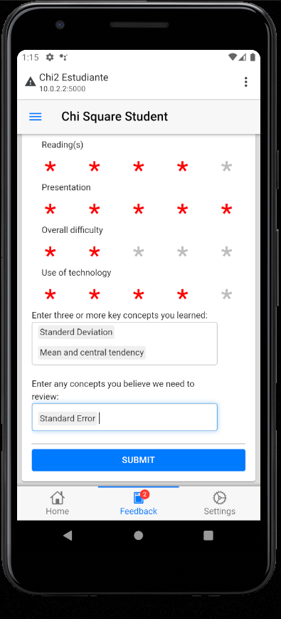
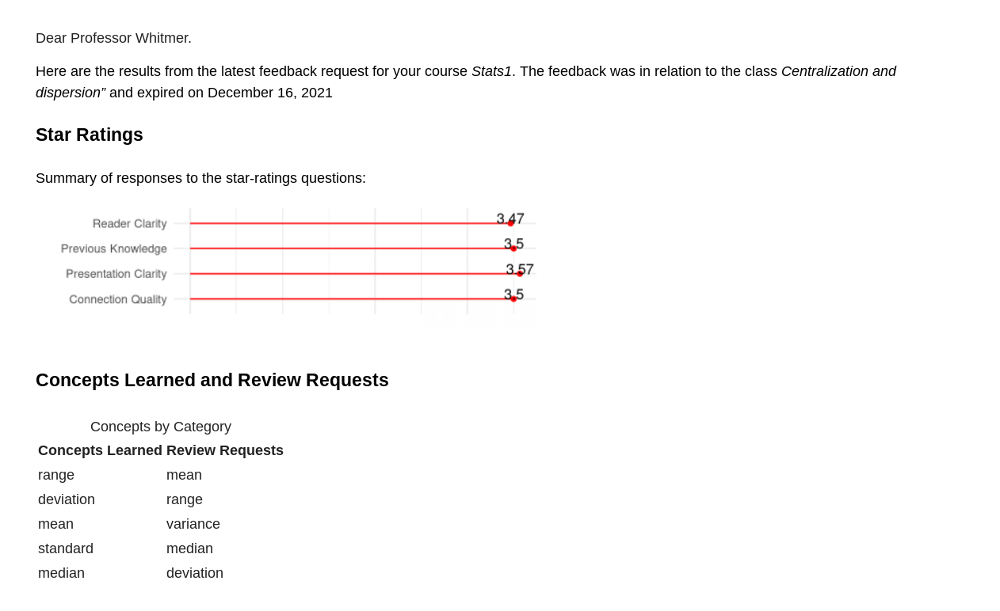
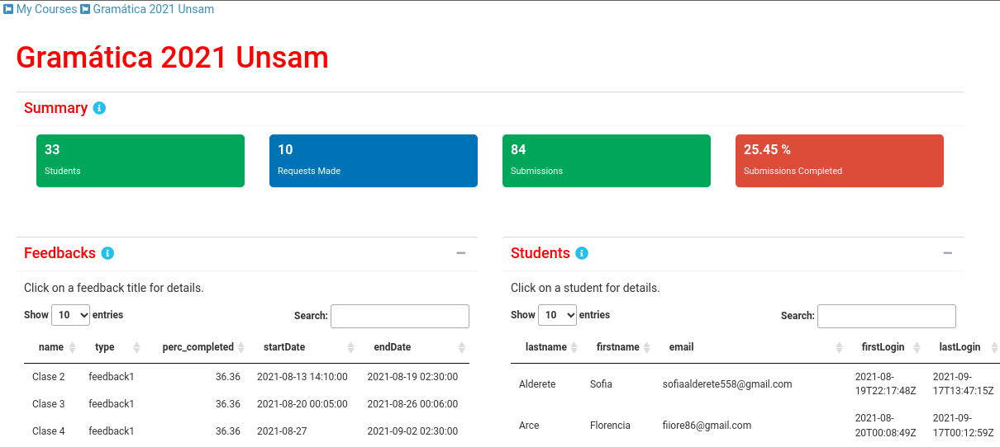
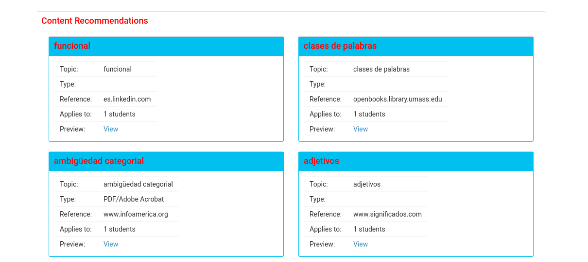

```{r setup, include=FALSE}
knitr::opts_chunk$set(echo = FALSE)
```

## About us

## Context

- Argentina goes into lockdown in March 2020
- Instruction is emergency onlined
- Typically defaulting to video-conferencing
- Only 41.4% of students have access to a computer
- 84% access the internet primarily through a mobile device

Any solution we propose must be mobile first.

## The Feedback Loop

:::: {.columns}
::: {.column width="60%"}

- Instructor teaches an online session
- Feedback is immediately requested from students
- Reported in realtime
- Recommendations made by AI


:::
::: {.column width="40%"}

```{r fig.cap='The Feedback Loop'}
knitr::include_graphics('./images/feedback_loop.png')
```


:::
::::

## First try: "Emergency alpha"

- Shiny + {shinyMobile} 
- Backend in mariaDB (AWS)
- Authentication with {cognitoR}
- Distributed as a PWA

## First try: "Emergency alpha"

:::: {.columns}
::: {.column width="50%"}
```{r out.height="90%"}
knitr::include_graphics("images/outputfile_8.png")
```

:::
::: {.column width="50%"}
```{r out.height="90%"}

```

:::
::::

## First try: "Emergency alpha"

:::: {.columns}
::: {.column width="50%"}
```{r out.height="90%"}
knitr::include_graphics("images/outputfile_2003.png")
```

:::
::: {.column width="50%"}
```{r out.height="90%"}

```

:::
::::


## First try: "Emergency alpha"

:::: {.columns}
::: {.column width="50%"}
- works
- updates quickly
- lightweight on devices
- cross-platform
:::
::: {.column width="50%"}

- bandwidth issues detected
- not a native app
- not scalable 

:::
::::


## Alpha 2.0 
:::: {.columns}
::: {.column width="50%"}
- Used template from Android community. 
  - e.g.: https://github.com/chi2labs/androidApps
- Quick updates since we're still showing a shiny app
- Playstore distribution
:::
::: {.column width="50%"}

- Requires *some* knowledge of java
- still not scalable 
- Android only

:::
::::


## In the wild

```{r echo=FALSE, out.width='100%'}
knitr::include_graphics("./images/example_usage.jpeg")
```


## The research track

```{r concept-count-vs-final-grade, echo=FALSE, message=FALSE, warning=FALSE}
library(tidyverse)
outcome_data <- read_rds(here::here("data","grades_gramatica_2011_2020.rds"))
my_data <- read_rds(here::here("data","my_data_fixed.rds"))
my_data %>% 
  pivot_longer(c(review_requests, learning_reported)) %>% 
  ggplot(aes(y=course_grade, x=value, color=name))+
  geom_point(key_glyph="path")+
  geom_smooth(method = "lm",lty=2, se=FALSE,
              key_glyph=NULL)+
  scale_y_continuous(breaks = 0:10, labels = 0:10,limits = c(0,10))+
  ylab("Course Grade")+
  xlab("Concept Count")+
  scale_color_discrete(labels = c(learning_reported = "Learning Reported",review_requests = "Review Requests")) +theme_minimal()+
  theme(legend.position = "top", legend.title = element_blank())
```

## The research track

- Most distributions are non-normal and some important outliers found in the data. Furthermore grades are on an ordinal scale, therefore:
  - Kendall's Tau (rank correlation)
  - Ordinal regression 
  
- Encouraging results 
  - Strong correlation (Tau > .3) found
  - Predictive after three weeks use
  - Good feedback from instructors
  

## NLP issues

- Plenty of pretrained models for general and specific purposes (e.g. medical/legal)
- Context of course becomes very specific (invalidating general models)
- Input issues 
- Spanish v. English 

## Beta 1.0

- True native app with **Flutter**
- Backend moved to Firebase (Google Cloud)
- Authentication by Google
- Analysis in R with plumber API for JIT calculations
- Content recommendations
- Email interface

## Beta 1.0


:::: {.columns}
::: {.column width="50%"}
```{r out.height="90%"}
knitr::include_graphics("./images2/english_03/X2 Mobile - English (01).png")
```

:::
::: {.column width="50%"}
```{r out.height="90%"}
knitr::include_graphics("./images2/english_03/X2 Mobile - English (09).png")
```

:::
::::

## Beta 1.0

Email integrated {blastula}

```{r}

```


## Feedback from instuctors

"It would be nice to have a unified dashboard online with all the information."


  --- Prof. Cecilia Magadán
  
## Instructor dashboard

```{r}

```

## Instructor dashboard

```{r}

```