```{r setup, include=FALSE}
knitr::opts_chunk$set(echo = FALSE)
```

## About us

- Aleksander Dietrichson
- John Whitmer
- Chi Square Labs

## Context

- Marzo 2020: Argentina entra en cuarentena
- Enseñanza online (emergencia)
- Típicamente por videoconferencia
- Solo el  41.4% de los estudiantes tienenn acceso a una computadora/laptop/tablet
- 84% Accede a internet a través de su celular
- Nuestra experiencia indica que «learning analytics» con «dashboards» tiene poco uso ya que queda fuera de contexto

Cualquier solución que propongamos tiene que ser primordialmente por celular.

## Bucle de retroalimentación (Feedback loop)

:::: {.columns}
::: {.column width="60%"}

- El instructor da una clase online (videoconferencia)
- Se pide retroalimentación de los estudiantes
- Reportado en tiempo real
- Recomendaciones realizadas por IA


:::
::: {.column width="40%"}

```{r fig.cap='The Feedback Loop'}
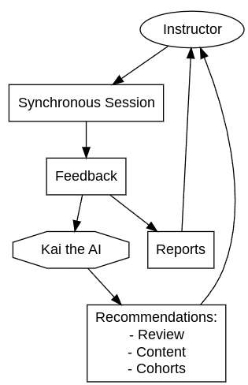
```


:::
::::

## Summary of Approaches
- Versión alfa «de emergencia» (marzo 2020)
- Versión alfa 2.0 (abril 2020)
- Beta 1.0 (augosto 2021) 

## Primer intento: «alfa de emergencia»

- Shiny + {shinyMobile} 
- Backend en mariaDB (AWS)
- Authentication with {cognitoR}
- Distribuido como un «progressive web app» (PWA)

## Primer intento: «alfa de emergencia»

:::: {.columns}
::: {.column width="50%"}
```{r out.height="90%"}
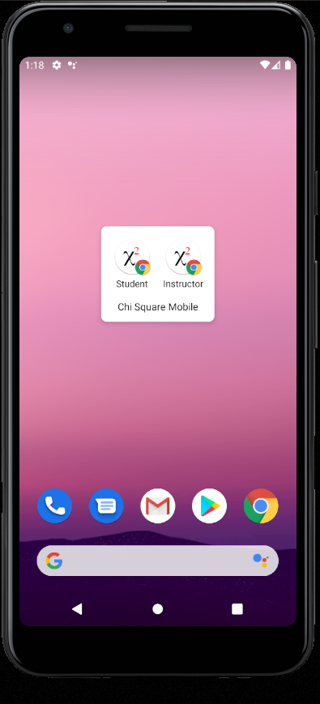
```

:::
::: {.column width="50%"}
```{r out.height="90%"}
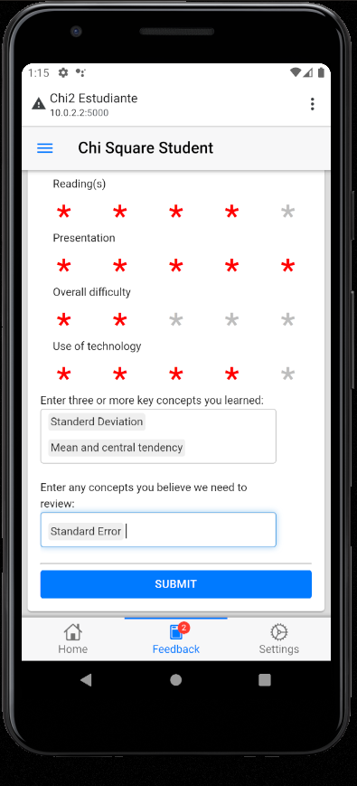
```

:::
::::

## Primer intento: «alfa de emergencia»

:::: {.columns}
::: {.column width="50%"}
```{r out.height="90%"}
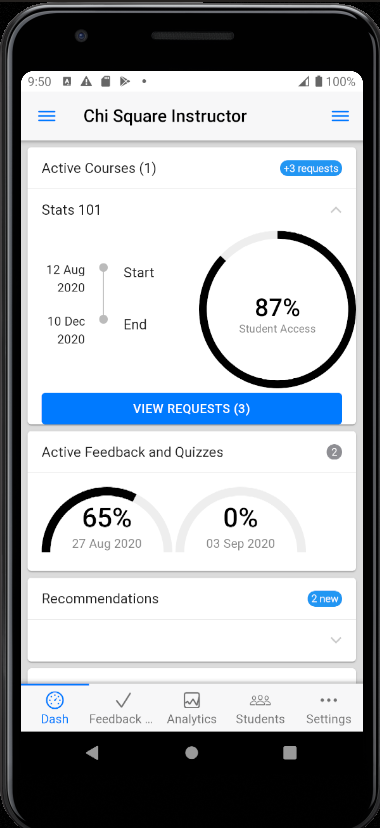
```

:::
::: {.column width="50%"}
```{r out.height="90%"}
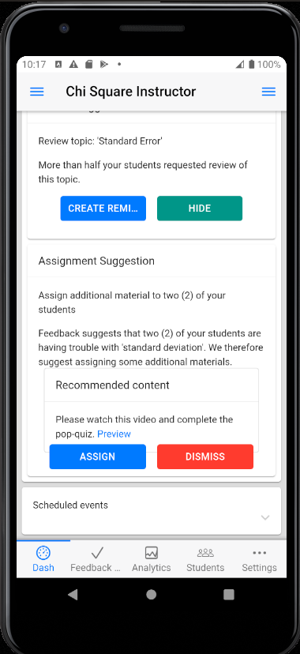
```

:::
::::


## Primer intento: «alfa de emergencia»

:::: {.columns}
::: {.column width="50%"}
- anda
- actualizaciones rápidas
- ocupa poco espacio
- funciona en android/iphone/windows
:::
::: {.column width="50%"}

- problemas de bandwidth
- no es una app nativa
- no es escalable 

:::
::::


## Alfa 2.0 
:::: {.columns}
::: {.column width="50%"}
- Se uso template de android 
  - e.g.: https://github.com/chi2labs/androidApps
- Actualizaciones rápidas (todavia es un shell a shiny)
- Distribución por el playstore
:::
::: {.column width="50%"}

- Requiere se *algún* conocimiento de java
- todavía no escalable 
- Android solo

:::
::::


## In the wild

```{r echo=FALSE, out.width='100%'}
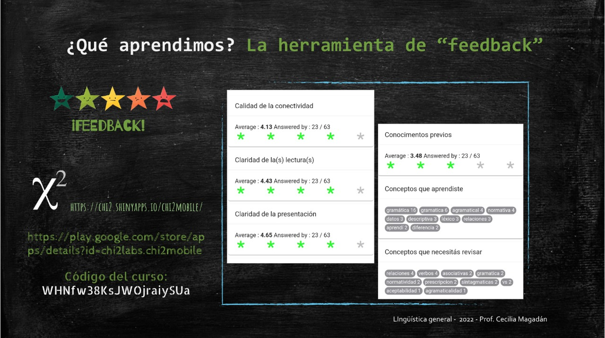
```


## Resultados

```{r concept-count-vs-final-grade, echo=FALSE, message=FALSE, warning=FALSE}
library(tidyverse)
outcome_data <- read_rds(here::here("data","grades_gramatica_2011_2020.rds"))
my_data <- read_rds(here::here("data","my_data_fixed.rds"))
my_data %>% 
  pivot_longer(c(review_requests, learning_reported)) %>% 
  ggplot(aes(y=course_grade, x=value, color=name))+
  geom_point(key_glyph="path")+
  geom_smooth(method = "lm",lty=2, se=FALSE,
              key_glyph=NULL)+
  scale_y_continuous(breaks = 0:10, labels = 0:10,limits = c(0,10))+
  ylab("Course Grade")+
  xlab("Concept Count")+
  scale_color_discrete(labels = c(learning_reported = "Learning Reported",review_requests = "Review Requests")) +theme_minimal()+
  theme(legend.position = "top", legend.title = element_blank())
```

## Resultados

- La mayoría de las distribuciones son estadísticamente no-normales luego hay algunos valores extremos presentes. 
- Las notas se miden en escala *ordinal*, por ende:
  - Kendall's Tau (correlación por rangos)
  - Regression ordinal
  
- Resultados alentadores 
  - Strong correlation (Tau > .3) found
  - Predictivo después de tres semanas
  - Buena recepción por los profesores
  

## Problemas relacionados con la PLN

- Existe una multitud de modelos pre-entrenados para uso general y especifico, tanto abiertos como de uso comercial
- El contexto suele ser muy específico --invalidando los modelos muy generales.
- Input
- Español versus inglés


## Beta 1.0

- App nativa con **Flutter**
- Backend en Firebase (Google Cloud)
- Autenticación por Google
- Analysis en R con {plumber} API para calculos en tiempo real
- Recomendaciones de contenido
- Interface por correo electrónico

## Beta 1.0


:::: {.columns}
::: {.column width="50%"}
```{r out.height="90%"}
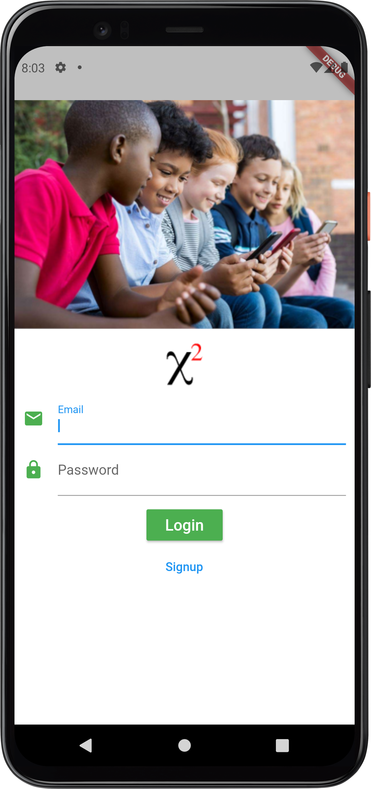
```

:::
::: {.column width="50%"}
```{r out.height="90%"}
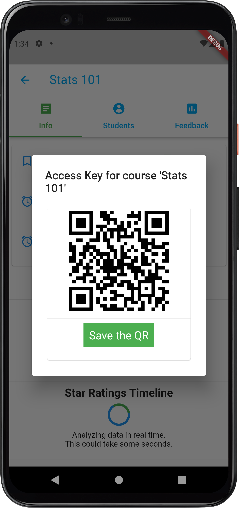
```

:::
::::

## Beta 1.0

Integración con correo electrónico {blastula}

```{r}
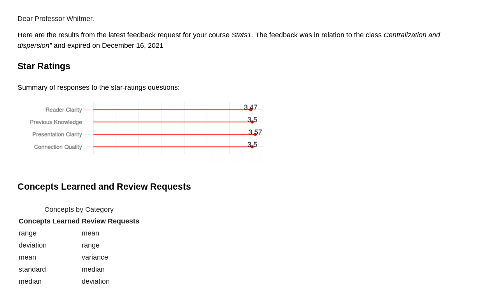
```


## Devolución de los profesores

«Sería bueno tener como un dashboard online para ver toda la información.»


  --- Prof. Cecilia Magadán
  
## Instructor dashboard

```{r}
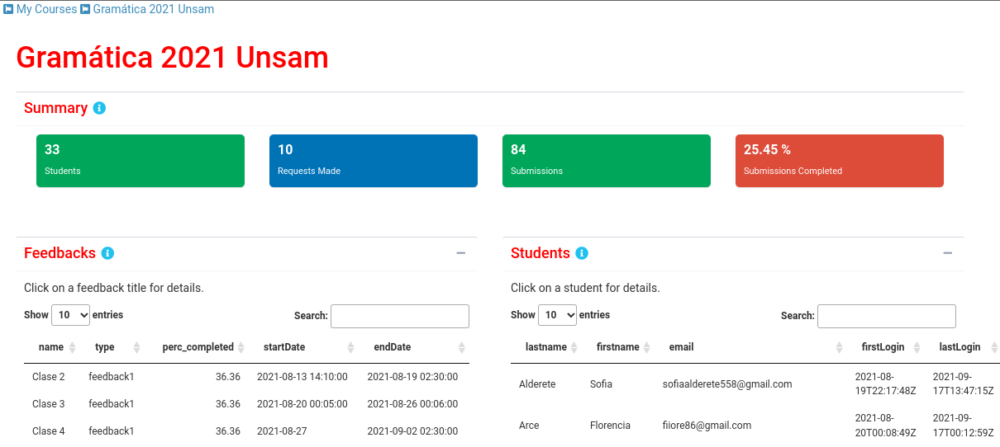
```

## Instructor dashboard

```{r}
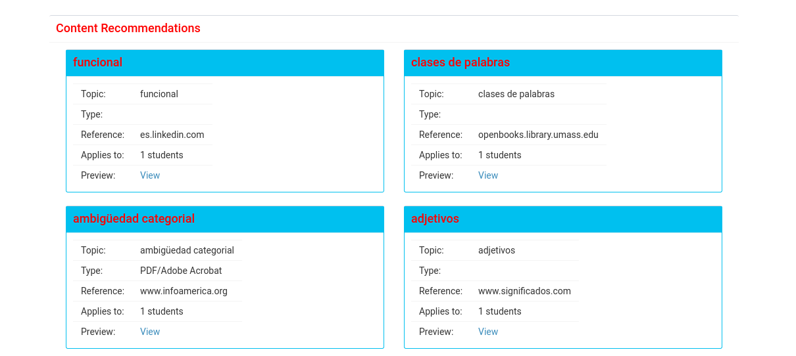
```

## Información de contacto

Website:

- https://www.chi2labs.com

Aleksander Dietrichson

- sasha@chi2labs.com

John Whitmer

- john@chi2labs.com

Pablo Pagnone

- pablo@chi2labs.com

Repositorios:

- https://github.com/chi2labs
- https://github.com/dietrichson
